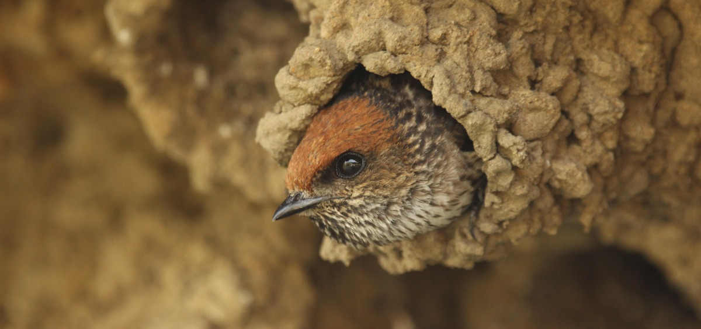
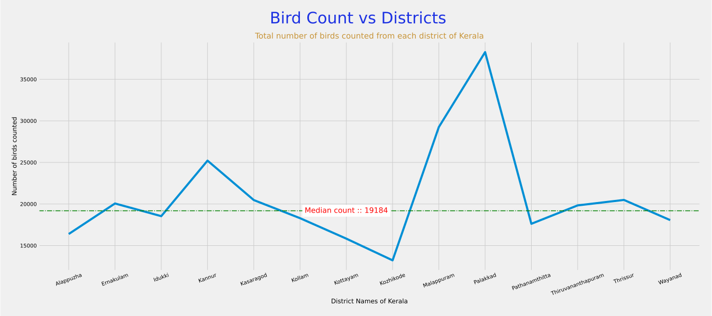

# Kerala Bird Atlas (KBA)



- The [Kerala Bird Atlas (KBA)](https://birdcount.in/kerala-bird-atlas/) is a first-of-its-kind state level birds atlas in India and was inspired by the [Mysore Bird Atlas](https://birdcount.in/mysore-bird-atlas/).
- The entire state of Kerala was divided into grids and was systematically surveyed twice a year, during the **wet** (July - September) and **dry** (January - March) seasons.
- The surveys for the KBA were constructed during **2015 to 2020** and it it the Asia's largest bird atlas in terms of geographical extent, sampling effort and the species coverage.
- KBA accounted for nearly three lakh records of **361** species, including **94** very rare species, **103** rare species, **110** common species, **44** very common species, and **10** most abundant species.

<div style="text-align:center;">
<br>
<a href = 'https://colab.research.google.com/github/jishnukoliyadan/Kerala_Bird_Atlas//blob/master/Kerala_Bird_Atlas.ipynb'></a>
<a href = 'https://github.com/jishnukoliyadan/Kerala_Bird_Atlas/blob/master/Kerala_Bird_Atlas.ipynb'></a>
<a href = 'https://www.kaggle.com/code/jishnukoliyadan/kerala-bird-atlas-eda'></a>
<a href = 'https://nbviewer.org/github/jishnukoliyadan/Kerala_Bird_Atlas/blob/master/Kerala_Bird_Atlas.ipynb'></a>
<br>
</div>

## Data Set

- The [data](https://www.kaggle.com/datasets/jishnukoliyadan/kerala-bird-atlas-20152020) is made available in the R object format, ie in **.rds** format.
- Saving data into R data formats can reduce the size of large files by considerably.
- In order to read the **.rds** files in Python we can use pyreadr package, which can be easily installable using `pip install pyreadr`.




## Getting Started

#### **Requirements :**

- Python veriosn used : **Python 3.9.12**
- [Python packages](requirements.txt)
```bash
pip install -r requirements.txt --upgrade
```
<br>

**Example : Reading *.rds* files.**
```python
!pip install pyreadr

import pyreadr

result = pyreadr.read_r('../path_to_file.rds') # also works for RData
print(f"Class type of 'result' \t:: {type(result)}")

df = result[None] # extract the pandas data frame
print(f"Class type of 'df' \t:: {type(df)}")

>>> Class type of 'result' 	:: <class 'collections.OrderedDict'>
>>> Class type of 'df' 	    :: <class 'pandas.core.frame.DataFrame'>
```


## Refernce & Credits
- [Bird Count India](https://birdcount.in/kerala-bird-atlas/)
- [The Hindu : Kerala gets its first ever scientific bird atlas](https://www.thehindu.com/news/national/kerala/kerala-gets-its-first-ever-scientific-bird-atlas/article38307794.ece)
- [Times of India : Mammoth survey for Kerala Bird Atlas ends](https://timesofindia.indiatimes.com/city/kochi/mammoth-survey-for-kerala-bird-atlas-ends/articleshow/78134787.cms)
- [Mysore Bird Atlas](https://birdcount.in/mysore-bird-atlas/)
- Images : [Saketh Upadhya](https://unsplash.com/@saketh_upadhya)


## License

The license can be found in the [LICENSE](LICENSE) file.